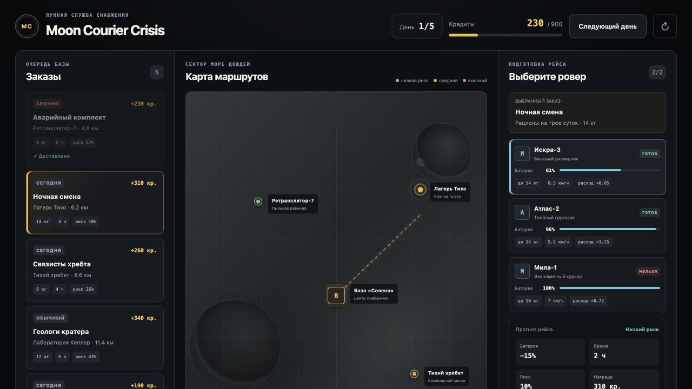

# Moon Courier Crisis

Небольшой однопользовательский симулятор лунной доставки. Игрок выбирает заказ и ровер, сравнивает расход батареи, время и риск маршрута, а затем пытается заработать 900 кредитов за 5 игровых дней.



## Что сделано

- карта с базой и четырьмя зонами, которые отличаются скоростью движения и риском;
- 3 ровера с разной батареей, грузоподъёмностью, скоростью и расходом;
- 6 заказов с весом, наградой, сроком и риском;
- прогноз рейса до запуска: расстояние, время, батарея, риск и награда;
- понятная причина блокировки, если ровер не подходит;
- случайное событие на рискованном маршруте;
- изменение денег, батареи, статуса заказа и журнала событий;
- зарядка роверов между игровыми днями;
- победа или поражение после пятого дня;
- автоматическое сохранение прохождения в браузере.

Один заказ весит 26 кг при максимальной грузоподъёмности ровера 24 кг. Он намеренно невыполним и показывает обязательный негативный сценарий.

## Быстрый старт

Нужен Node.js 22.13 или новее.

```bash
npm install
npm run dev
```

Открыть [http://localhost:3000](http://localhost:3000).

Проверки:

```bash
npm run test:unit
npm test
npm run lint
```

`npm test` сначала собирает приложение, затем запускает тесты игровой логики и проверку серверного HTML.

## Правила доставки

Расстояние в данных указано в одну сторону, но ровер должен вернуться на базу.

```text
коэффициент веса = 1 + (вес / грузоподъёмность) × 0.35

расход батареи = округление вверх(
  расстояние × 2
  × расход ровера
  × коэффициент веса
  × коэффициент местности
)
```

Перед запуском дополнительно требуется 8% батареи в качестве резерва. Резерв не списывается при обычном рейсе.

```text
время = округление вверх(
  расстояние × 2 / (скорость ровера × коэффициент скорости зоны)
)

риск = риск зоны + добавочный риск заказа
```

Доставка блокируется, если:

- вес больше грузоподъёмности;
- батареи не хватает на расчётный расход и резерв;
- ровер заряжается;
- расчётное время больше срока заказа;
- заказ уже выполнен.

Если срабатывает риск маршрута, ровер тратит дополнительные 5% батареи, а награда уменьшается на 25%. Формулы вынесены из интерфейса в `app/game.ts`, поэтому их можно проверять отдельно.

## Данные и хранение

Начальные данные находятся в `app/game-data.ts`:

- `ZONES` — точки карты и коэффициенты местности;
- `INITIAL_ROVERS` — характеристики роверов;
- `INITIAL_ORDERS` — заказы.

Текущее состояние игры содержит роверы, заказы, доставки и события. Оно сохраняется в `localStorage` под версионированным ключом `moon-courier-crisis:v1`.

Для тестового выбран `localStorage`, потому что игра однопользовательская и не требует синхронизации между устройствами. Полноценная серверная база добавила бы инфраструктуру, но не улучшила основной сценарий. При необходимости состояние можно заменить серверным хранилищем без изменения расчётных функций.

## Структура

```text
app/
  GameBoard.tsx   интерфейс и действия игрока
  game.ts         правила и изменение состояния
  game-data.ts    стартовые данные
  globals.css     карта и адаптивный интерфейс
tests/
  game.test.ts    тесты веса, батареи, риска и результата
  rendered-html.test.mjs
```

Проект намеренно оставлен небольшим: без авторизации, бэкенда, таймеров реального времени и внешних API.

## Использование AI

При разработке использовался OpenAI Codex как помощник:

- разбиение задания на минимальный игровой сценарий;
- черновой вариант интерфейса и стартовых данных;
- подбор тестовых негативных сценариев;
- проверка формулировок README.

AI не используется внутри самой игры. Формулы, баланс, условия блокировки и итоговый код были проверены вручную и автоматическими тестами. Сгенерированный AI social-preview используется только как изображение ссылки и не участвует в интерфейсе.

## Ограничения

- прогресс хранится только в текущем браузере;
- риск использует простой случайный бросок, поэтому повторный рейс может дать другой результат;
- после обновления версии формата старое сохранение может быть сброшено;
- баланс рассчитан на короткую демонстрационную сессию, а не на долгую игру.

## Скриншоты

- [Игровое поле](screenshots/game-board.jpg)
- [Невозможная доставка](screenshots/impossible-delivery.jpg)
