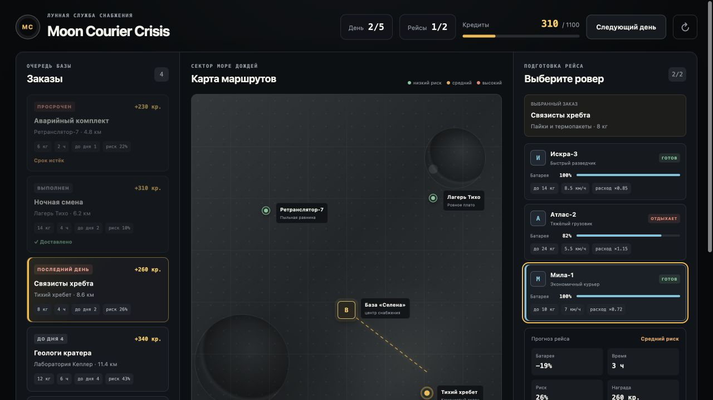

# Moon Courier Crisis

Небольшой однопользовательский симулятор лунной доставки. Игрок выбирает заказ и ровер, сравнивает расход батареи, время и риск маршрута, а затем пытается заработать 1100 кредитов за 5 игровых дней.

**[Открыть публичное демо](https://maunti689.github.io/moon-courier-crisis/)**



## Что сделано

- карта с базой и четырьмя зонами, которые отличаются скоростью движения и риском;
- 3 ровера с разной батареей, грузоподъёмностью, скоростью и расходом;
- 6 заказов с весом, наградой, сроком и риском;
- прогноз рейса до запуска: расстояние, время, батарея, риск и награда;
- понятная причина блокировки, если ровер не подходит;
- случайное событие на рискованном маршруте;
- изменение денег, батареи, статуса заказа и журнала событий;
- максимум 2 рейса базы в день и 1 рейс каждого ровера;
- реальные сроки заказов по игровым дням и просрочка;
- зарядка роверов между игровыми днями;
- победа или поражение после пятого дня;
- автоматическое сохранение прохождения в браузере.

Один заказ весит 26 кг при максимальной грузоподъёмности ровера 24 кг. Он намеренно невыполним и показывает обязательный негативный сценарий.

## Быстрый старт

Нужен Node.js 22.13 или новее.

```bash
npm install
npm run dev
```

Открыть [http://localhost:3000](http://localhost:3000).

Проверки:

```bash
npm run test:unit
npm run typecheck
npm test
npm run lint
```

`npm test` проверяет TypeScript, собирает приложение, запускает тесты игровой логики и проверку серверного HTML.

## Игровой цикл

- смена длится 5 дней, цель — заработать 1100 кредитов;
- база может запустить не больше 2 доставок в день;
- после рейса ровер отдыхает до следующего дня;
- у каждого заказа есть последний игровой день, после которого заказ просрочен;
- новый день заряжает каждый ровер на 38%;
- намеренно невыполнимый заказ не требуется для победы.

Такой баланс не позволяет закрыть все доступные заказы в первый день. При серии происшествий пяти выполненных доставок может не хватить для цели, поэтому риск маршрута влияет на итог игры.

## Правила доставки

Расстояние в данных указано в одну сторону, но ровер должен вернуться на базу.

```text
коэффициент веса = 1 + (вес / грузоподъёмность) × 0.35

расход батареи = округление вверх(
  расстояние × 2
  × расход ровера
  × коэффициент веса
  × коэффициент местности
)
```

Перед запуском дополнительно требуется 8% батареи в качестве резерва. Резерв не списывается при обычном рейсе.

```text
время = округление вверх(
  расстояние × 2 / (скорость ровера × коэффициент скорости зоны)
)

риск = риск зоны + добавочный риск заказа
```

Доставка блокируется, если:

- вес больше грузоподъёмности;
- батареи не хватает на расчётный расход и резерв;
- ровер уже выполнил рейс в этот день;
- база уже запустила 2 рейса в этот день;
- расчётное время больше срока заказа;
- последний день заказа прошёл;
- заказ уже выполнен.

Если срабатывает риск маршрута, ровер тратит дополнительные 5% батареи, а награда уменьшается на 25%. Формулы вынесены из интерфейса в `app/game.ts`, поэтому их можно проверять отдельно.

## Данные и хранение

Начальные данные находятся в `app/game-data.ts`:

- `ZONES` — точки карты и коэффициенты местности;
- `INITIAL_ROVERS` — характеристики роверов;
- `INITIAL_ORDERS` — заказы.

Текущее состояние игры содержит роверы, заказы, доставки и события. Оно сохраняется в `localStorage` под версионированным ключом `moon-courier-crisis:v2`. При чтении проверяется не только корневой объект, но и структура вложенных данных.

Для тестового выбран `localStorage`, потому что игра однопользовательская и не требует синхронизации между устройствами. Полноценная серверная база добавила бы инфраструктуру, но не улучшила основной сценарий. При необходимости состояние можно заменить серверным хранилищем без изменения расчётных функций.

## Структура

```text
app/
  GameBoard.tsx   интерфейс и действия игрока
  game.ts         правила и изменение состояния
  game-data.ts    стартовые данные
  globals.css     карта и адаптивный интерфейс
tests/
  game.test.ts    тесты веса, батареи, риска и результата
  rendered-html.test.mjs
```

Проект намеренно оставлен небольшим: без авторизации, бэкенда, таймеров реального времени и внешних API.

## Использование AI

AI использовался как вспомогательный инструмент для черновика интерфейса, проверки негативных сценариев и оформления README. Игровые правила, баланс и итоговый результат проверены вручную и автоматическими тестами. Во время работы самой игры обращения к AI-сервисам не выполняются.

## Ограничения

- прогресс хранится только в текущем браузере;
- риск использует простой случайный бросок, поэтому повторный рейс может дать другой результат;
- после обновления версии формата старое сохранение может быть сброшено;
- баланс рассчитан на короткую демонстрационную сессию, а не на долгую игру;
- случайность может привести к поражению даже при пяти доставках — это осознанная часть риска.

## Скриншоты

- [Игровое поле](screenshots/game-board.png)
- [Невозможная доставка](screenshots/impossible-delivery.png)
